# Philips Hue API v2 Architecture Guide

A comprehensive, beginner-friendly guide to understanding how the Philips Hue smart lighting system works under the hood.

---

## Table of Contents

1. [Introduction](#introduction)
2. [The Big Picture](#the-big-picture)
3. [The Hue Bridge](#the-hue-bridge)
4. [Devices and Services](#devices-and-services)
5. [Rooms vs Zones](#rooms-vs-zones)
6. [Grouped Lights](#grouped-lights)
7. [Scenes](#scenes)
8. [The Color System](#the-color-system)
9. [Effects](#effects)
10. [Entertainment](#entertainment)
11. [How Everything Connects](#how-everything-connects)
12. [Glossary](#glossary)

---

## Introduction

### What is the Hue API?

The Philips Hue API (Application Programming Interface) is how software communicates with your Hue smart lights. When you use the Hue app on your phone, it's talking to your lights through this API. The current version is called **CLIP v2** (Connected Lighting Interface Protocol, version 2).

Think of the API as a universal translator between human intentions ("turn on the living room lights") and the technical commands your lights understand.

### Who is this guide for?

This guide is for anyone who wants to understand how Hue lights work behind the scenes—whether you're a curious user, a hobbyist programmer, or someone building their own smart home integration.

---

## The Big Picture

Before diving into details, here's how all the pieces fit together:

```mermaid
graph TB
    subgraph "Your Home"
        Bridge[("🌉 Hue Bridge<br/>(The Brain)")]

        subgraph "Physical Devices"
            Bulb1["💡 Bulb 1"]
            Bulb2["💡 Bulb 2"]
            Bulb3["💡 Bulb 3"]
            Switch["🔘 Dimmer Switch"]
            Sensor["👁️ Motion Sensor"]
        end

        subgraph "Logical Groups"
            Room1["🏠 Living Room"]
            Room2["🛏️ Bedroom"]
            Zone1["🌅 Sunset Zone"]
        end

        subgraph "Saved Settings"
            Scene1["🎨 Relax Scene"]
            Scene2["☀️ Energize Scene"]
        end
    end

    Phone["📱 Phone App"] --> Bridge
    Computer["💻 Computer"] --> Bridge
    Voice["🎤 Voice Assistant"] --> Bridge

    Bridge --> Bulb1
    Bridge --> Bulb2
    Bridge --> Bulb3
    Bridge --> Switch
    Bridge --> Sensor

    Room1 -.->|contains| Bulb1
    Room1 -.->|contains| Bulb2
    Room2 -.->|contains| Bulb3
    Zone1 -.->|includes| Bulb1
    Zone1 -.->|includes| Bulb3

    Scene1 -.->|belongs to| Room1
    Scene2 -.->|belongs to| Room1
```

**Key concepts:**
- The **Bridge** is the central hub that controls everything
- **Devices** are physical things (bulbs, switches, sensors)
- **Rooms** and **Zones** are ways to group lights
- **Scenes** are saved lighting configurations

---

## The Hue Bridge

### What is it?

The Hue Bridge is the "brain" of your Hue system. It's the small square device you plug into your router. Every command to your lights goes through the Bridge.

### What does it do?

```mermaid
flowchart LR
    subgraph "External"
        App["📱 Hue App"]
        Cloud["☁️ Hue Cloud"]
        HomeKit["🏠 HomeKit"]
    end

    subgraph "Bridge"
        API["🔌 API Server"]
        Memory["💾 Configuration"]
        Radio["📡 Zigbee Radio"]
    end

    subgraph "Lights"
        L1["💡"]
        L2["💡"]
        L3["💡"]
    end

    App <--> API
    Cloud <--> API
    HomeKit <--> API

    API <--> Memory
    API <--> Radio

    Radio <-.->|"Zigbee Mesh"| L1
    Radio <-.->|"Zigbee Mesh"| L2
    Radio <-.->|"Zigbee Mesh"| L3

    L1 <-.-> L2
    L2 <-.-> L3
```

The Bridge:

1. **Runs a web server** - It hosts the API that apps communicate with
2. **Stores configuration** - It remembers your rooms, scenes, schedules, and settings
3. **Speaks Zigbee** - It has a radio that talks to your lights using the Zigbee protocol
4. **Acts as a mesh coordinator** - Your lights form a "mesh network" where signals can hop from bulb to bulb

### Bridge Home

The Bridge has a special group called **"bridge_home"** that automatically includes every light in your system. It's like a master switch for your entire house.

---

## Devices and Services

This is one of the most important concepts to understand in Hue API v2.

### The Device-Service Model

In the Hue world, there's an important distinction:

- A **Device** is a physical thing you can touch (a light bulb, a switch, a sensor)
- A **Service** is a capability that device provides (light control, button presses, motion detection)

```mermaid
graph TB
    subgraph "Physical Device: Color Bulb"
        Device["🔮 Device<br/>(The physical bulb)"]

        subgraph "Services it provides"
            Light["💡 Light Service<br/>(on/off, brightness, color)"]
            Zigbee["📡 Zigbee Connectivity<br/>(connection status)"]
            Entertainment["🎮 Entertainment<br/>(streaming mode)"]
        end

        Device --> Light
        Device --> Zigbee
        Device --> Entertainment
    end
```

### Why separate Devices from Services?

Consider a Hue Motion Sensor. It's one physical device, but it provides multiple services:

```mermaid
graph TB
    subgraph "Motion Sensor Device"
        MotionDevice["🔮 Physical Sensor"]

        Motion["👁️ Motion Service<br/>(detects movement)"]
        LightLevel["☀️ Light Level Service<br/>(measures brightness)"]
        Temp["🌡️ Temperature Service<br/>(measures temperature)"]
        Battery["🔋 Battery Service<br/>(reports power level)"]
        ZigbeeConn["📡 Zigbee Connectivity"]

        MotionDevice --> Motion
        MotionDevice --> LightLevel
        MotionDevice --> Temp
        MotionDevice --> Battery
        MotionDevice --> ZigbeeConn
    end
```

This separation allows the API to be flexible and consistent. Every light service works the same way, whether it's in a bulb, a light strip, or a lamp.

### Resource Identifiers

Every device and service has a unique ID (UUID), like: `d1ae958e-8908-449a-9897-7f10f9b8d4c2`

When one resource refers to another, it uses a **Resource Reference** containing:
- `rid` (Resource ID) - The unique identifier
- `rtype` (Resource Type) - What kind of thing it is (light, device, room, etc.)

```json
{
    "rid": "d1ae958e-8908-449a-9897-7f10f9b8d4c2",
    "rtype": "light"
}
```

### The Owner Relationship

Services have an "owner" - the device that provides them. This creates a clear hierarchy:


---

## Rooms vs Zones

Both Rooms and Zones are ways to group lights together, but they work differently.

### Rooms

A **Room** represents a physical space in your home.

Key characteristics:
- A device can only belong to **one Room**
- Rooms contain **Devices** (not lights directly)
- Every light in a device becomes part of that Room

```mermaid
graph TB
    subgraph "Living Room (Room)"
        Room["🏠 Living Room"]

        subgraph "Contains Devices"
            D1["Device: Floor Lamp"]
            D2["Device: Ceiling Light"]
        end

        subgraph "Which provide Light Services"
            L1["💡 Floor Lamp Light"]
            L2["💡 Ceiling Light 1"]
            L3["💡 Ceiling Light 2"]
        end

        Room -->|children| D1
        Room -->|children| D2
        D1 -->|provides| L1
        D2 -->|provides| L2
        D2 -->|provides| L3
    end
```

### Zones

A **Zone** is a flexible grouping that can span multiple rooms.

Key characteristics:
- A light can belong to **multiple Zones**
- Zones contain **Light Services** directly (not devices)
- Useful for cross-room scenarios

```mermaid
graph TB
    subgraph "Example: 'Reading Nook' Zone"
        Zone["📍 Reading Nook Zone"]

        L1["💡 Living Room Floor Lamp"]
        L2["💡 Bedroom Desk Lamp"]
        L3["💡 Office Task Light"]

        Zone -->|"includes"| L1
        Zone -->|"includes"| L2
        Zone -->|"includes"| L3
    end

    subgraph "These lights also belong to Rooms"
        R1["🏠 Living Room"]
        R2["🛏️ Bedroom"]
        R3["🖥️ Office"]

        R1 -.->|contains| L1
        R2 -.->|contains| L2
        R3 -.->|contains| L3
    end
```

### Rooms vs Zones: When to Use Each

| Feature | Room | Zone |
|---------|------|------|
| **Purpose** | Physical spaces | Flexible groupings |
| **Contains** | Devices | Light services |
| **Membership** | Exclusive (one room only) | Overlapping (many zones) |
| **Examples** | "Kitchen", "Bedroom" | "Downstairs", "Party Lights", "TV Area" |

### Room Archetypes

Rooms and Zones have an "archetype" that tells the Hue app what icon to display:

- `living_room`, `kitchen`, `dining`, `bedroom`, `kids_bedroom`
- `bathroom`, `nursery`, `recreation`, `office`, `gym`
- `hallway`, `toilet`, `front_door`, `garage`, `terrace`
- `garden`, `driveway`, `carport`, `home`, `downstairs`, `upstairs`
- `top_floor`, `attic`, `guest_room`, `staircase`, `lounge`
- `man_cave`, `computer`, `studio`, `music`, `tv`, `closet`
- `storage`, `laundry_room`, `balcony`, `porch`, `barbecue`
- `pool`, `other`

---

## Grouped Lights

### What is a Grouped Light?

Every Room and Zone automatically gets a **grouped_light** service. This is how you control all the lights in a group with a single command.

```mermaid
graph TB
    subgraph "Living Room"
        Room["🏠 Living Room<br/>(Room Resource)"]
        GL["💡 Grouped Light<br/>(Service)"]

        Room -->|"has service"| GL

        subgraph "Individual Lights"
            L1["💡 Light 1"]
            L2["💡 Light 2"]
            L3["💡 Light 3"]
        end

        GL -.->|"controls"| L1
        GL -.->|"controls"| L2
        GL -.->|"controls"| L3
    end
```

### Why Use Grouped Lights?

**Efficiency**: Instead of sending 10 separate commands to 10 lights, you send 1 command to the grouped_light.

**Atomicity**: All lights change together, creating a more coordinated effect.

**Simplicity**: When you say "turn on the living room," the system uses the grouped_light.

### Grouped Light State

The grouped_light also provides aggregate state information:

```json
{
    "id": "abc123",
    "owner": {"rid": "room-id", "rtype": "room"},
    "on": {"on": true},
    "dimming": {"brightness": 75.0}
}
```

Note: The `on` state is `true` if *any* light in the group is on.

---

## Scenes

### What is a Scene?

A **Scene** is a saved lighting configuration—a snapshot of how you want your lights to look. Scenes store:
- Which lights are included
- Each light's brightness
- Each light's color or color temperature
- Transition timing
- Optional dynamic behavior

```mermaid
graph TB
    subgraph "Scene: 'Movie Night'"
        Scene["🎬 Movie Night Scene"]

        subgraph "Stored Actions"
            A1["💡 TV Backlight<br/>Blue, 30% brightness"]
            A2["💡 Floor Lamp<br/>Warm white, 10%"]
            A3["💡 Ceiling Light<br/>OFF"]
        end

        Scene --> A1
        Scene --> A2
        Scene --> A3
    end

    Group["🏠 Living Room"] -.->|"scene belongs to"| Scene
```

### Scene Anatomy

A scene consists of several parts:

```mermaid
graph LR
    subgraph "Scene Structure"
        Metadata["📋 Metadata<br/>(name, image)"]
        Group["🏠 Group<br/>(room/zone it belongs to)"]
        Actions["🎯 Actions<br/>(per-light settings)"]
        Palette["🎨 Palette<br/>(color options)"]
        Dynamics["⚡ Dynamics<br/>(speed, auto_dynamic)"]
    end
```

#### Metadata
- **Name**: What you call the scene ("Relax", "Energize", "Movie Night")
- **Image**: Optional icon from Hue's library of scene images

#### Group Association
Every scene belongs to exactly one group (Room, Zone, or bridge_home). The scene includes all lights from that group.

#### Actions
Individual light settings within the scene:

```json
{
    "target": {"rid": "light-id", "rtype": "light"},
    "action": {
        "on": {"on": true},
        "dimming": {"brightness": 50.0},
        "color_temperature": {"mirek": 366},
        "dynamics": {"duration": 1000}
    }
}
```

#### Palette
For dynamic scenes, the palette defines colors that lights will cycle through:

```json
{
    "color": [
        {"color": {"xy": {"x": 0.5, "y": 0.4}}, "dimming": {"brightness": 80}}
    ],
    "color_temperature": [
        {"color_temperature": {"mirek": 250}, "dimming": {"brightness": 60}}
    ],
    "dimming": [{"brightness": 40}],
    "effects": []
}
```

### Static vs Dynamic Scenes

```mermaid
graph TB
    subgraph "Static Scene"
        S1["Each light has a<br/>fixed color/brightness"]
        S2["Lights stay constant<br/>until changed"]
        S3["Example: 'Bright' scene<br/>All lights white, 100%"]
    end

    subgraph "Dynamic Scene"
        D1["Palette of colors<br/>defined"]
        D2["Lights slowly shift<br/>between palette colors"]
        D3["Example: 'Sunset' scene<br/>Shifts orange → red → purple"]
    end
```

**Static scenes**: Lights go to their defined states and stay there.

**Dynamic scenes**: Lights continuously shift between colors from the palette. The `speed` property (0.0-1.0) controls how fast colors change.

### Recalling a Scene

When you activate ("recall") a scene, you can specify:

| Parameter | Description |
|-----------|-------------|
| `action: "active"` | Normal recall—lights go to scene state |
| `action: "dynamic_palette"` | Force dynamic mode (cycling colors) |
| `action: "static"` | Force static mode (no cycling) |
| `duration` | Transition time in milliseconds |
| `dimming.brightness` | Override the scene's brightness |

---

## The Color System

Hue lights use a sophisticated color system that ensures colors look correct across different bulb types.

### CIE xy Color Space

Instead of RGB, Hue uses the **CIE 1931 xy color space**. This is a scientific color model that represents all colors visible to humans.

```
       0.9 ┌────────────────────────────┐
           │            ╱╲              │
           │           ╱  ╲   Green     │
       0.7 │          ╱    ╲            │
           │         ╱      ╲           │
         y │        ╱        ╲          │
       0.5 │       ╱  Visible ╲         │
           │      ╱   Colors   ╲        │
       0.3 │     ╱              ╲       │
           │    ╱________________╲      │
           │  Red            Blue       │
       0.1 │                            │
           └────────────────────────────┘
             0.1    0.3    0.5    0.7   x
```

A color is represented as two coordinates:
- **x**: 0.0 to 1.0 (roughly red-green axis)
- **y**: 0.0 to 1.0 (roughly luminance-related)

Example xy values:
| Color | x | y |
|-------|-----|-----|
| Red | 0.675 | 0.322 |
| Green | 0.409 | 0.518 |
| Blue | 0.167 | 0.040 |
| White (D65) | 0.313 | 0.329 |

### Color Gamuts

Not all lights can display all colors. Each Hue product has a **gamut**—a triangle of colors it can produce.


| Gamut | Products | Red | Green | Blue |
|-------|----------|-----|-------|------|
| A | LivingColors, Iris, Bloom | (0.704, 0.296) | (0.215, 0.711) | (0.138, 0.080) |
| B | Original Hue bulbs | (0.675, 0.322) | (0.409, 0.518) | (0.167, 0.040) |
| C | Modern Hue bulbs | (0.692, 0.308) | (0.170, 0.700) | (0.153, 0.048) |

If you request a color outside a light's gamut, the Bridge finds the closest color the light can actually produce.

### Color Temperature (Mirek)

For white/warm light, Hue uses **mirek** (also called "mired")—a unit for color temperature.

**Conversion formula:**
```
mirek = 1,000,000 ÷ Kelvin
Kelvin = 1,000,000 ÷ mirek
```

| Mirek | Kelvin | Description |
|-------|--------|-------------|
| 153 | ~6,500K | Cool daylight (bluish white) |
| 250 | 4,000K | Cool white |
| 333 | ~3,000K | Warm white |
| 400 | 2,500K | Very warm (incandescent) |
| 500 | 2,000K | Warmest (candlelight) |

```
Cool ◄──────────────────────────────────► Warm
153 mirek                            500 mirek
(6500K)                              (2000K)
Daylight                             Candlelight
```

Different bulbs support different ranges:
- **White Ambiance**: 153-454 mirek (6,500K-2,200K)
- **Color Ambiance**: 153-500 mirek (6,500K-2,000K)

---

## Effects

Hue lights support various visual effects beyond simple colors.

### Basic Effects

Applied to individual lights via the `effects` property:

| Effect | Description |
|--------|-------------|
| `no_effect` | Normal operation |
| `candle` | Flickering candlelight simulation |
| `fire` | Fireplace-like flickering |
| `prism` | Color-shifting effect |
| `sparkle` | Sparkling/twinkling effect |
| `opal` | Smooth color transitions |
| `glisten` | Gentle shimmering |

### Timed Effects

Special effects that run for a specified duration:

| Effect | Description |
|--------|-------------|
| `sunrise` | Gradually brightens and warms (simulates sunrise) |
| `sunset` | Gradually dims and warms (simulates sunset) |

```json
{
    "timed_effects": {
        "effect": "sunrise",
        "duration": 1800000
    }
}
```
*Duration is in milliseconds (1,800,000ms = 30 minutes)*

### Signaling

Used for alerts and notifications:

| Signal | Description |
|--------|-------------|
| `no_signal` | Stop signaling |
| `on_off` | Flash on and off |
| `on_off_color` | Flash a specific color |
| `alternating` | Alternate between colors |

---

## Entertainment

The Entertainment API enables high-speed, synchronized light control for immersive experiences like gaming, movies, or music visualization.

### Entertainment Configuration

An entertainment setup defines:
- Which lights participate
- Their physical positions in 3D space
- How they're grouped into channels


### Configuration Types

| Type | Use Case |
|------|----------|
| `screen` | TV or monitor sync |
| `monitor` | Computer monitor sync |
| `music` | Audio visualization |
| `3dspace` | Room-scale experiences |
| `other` | Custom setups |

### Streaming Mode

When entertainment streaming is active:
- The API switches to UDP for lower latency
- Lights update up to 25 times per second
- Normal API rate limits are bypassed
- Other apps can't control those lights until streaming ends

---

## How Everything Connects

Here's the complete picture of how all resources relate:


### The Complete Flow

When you say "Set the living room to Relax":

```mermaid
sequenceDiagram
    participant App as 📱 App
    participant Bridge as 🌉 Bridge
    participant Room as 🏠 Room
    participant Scene as 🎨 Scene
    participant GL as 💡 Grouped Light
    participant Lights as 💡💡💡 Lights

    App->>Bridge: Find scene "Relax" in "Living Room"
    Bridge->>Room: Get room by name
    Bridge->>Scene: Find scene for this room
    Bridge-->>App: Scene found (id: xyz)

    App->>Bridge: PUT /scene/xyz {recall: {action: "active"}}
    Bridge->>Scene: Get scene actions
    Bridge->>Lights: Apply individual light states

    Note over Lights: Each light transitions<br/>to its scene state

    Bridge-->>App: Success
```

---

## Glossary

| Term | Definition |
|------|------------|
| **Bridge** | The central hub that connects to your router and controls all Hue devices |
| **Device** | A physical piece of hardware (bulb, switch, sensor) |
| **Service** | A capability provided by a device (light control, motion sensing) |
| **Room** | A physical space grouping; contains devices exclusively |
| **Zone** | A flexible grouping; can include lights from multiple rooms |
| **Grouped Light** | A service that controls all lights in a room/zone together |
| **Scene** | A saved lighting configuration with per-light settings |
| **Palette** | A set of colors used in dynamic scenes |
| **Gamut** | The range of colors a specific light can produce |
| **Mirek** | Unit for color temperature (1,000,000 ÷ Kelvin) |
| **CIE xy** | The color coordinate system used by Hue |
| **Zigbee** | The wireless protocol lights use to communicate |
| **Archetype** | A category label (like "living_room") for rooms and zones |
| **Resource Reference** | A pointer to another resource using rid and rtype |
| **SSE** | Server-Sent Events; how the Bridge pushes real-time updates |
| **Entertainment** | High-speed streaming mode for synchronized light shows |

---

## Further Reading

- [Philips Hue Developer Portal](https://developers.meethue.com/)
- [OpenHue API Specification](https://github.com/openhue/openhue-api)
- [openHAB Hue Binding (v2 docs)](https://www.openhab.org/addons/bindings/hue/doc/readme_v2.html)

---

*This document was created to help developers and enthusiasts understand the Philips Hue API v2 (CLIP) architecture. For the most up-to-date information, always refer to the official Philips Hue Developer documentation.*
